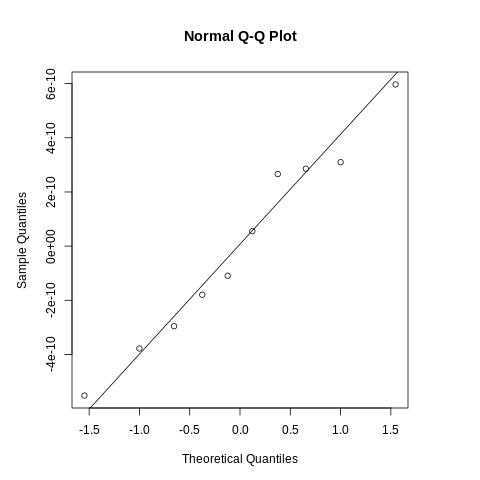
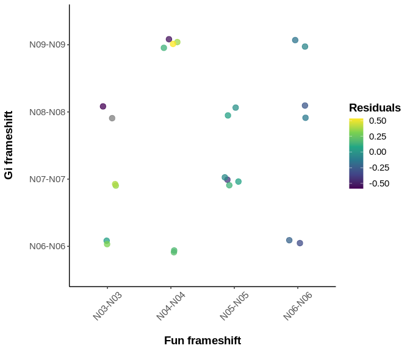
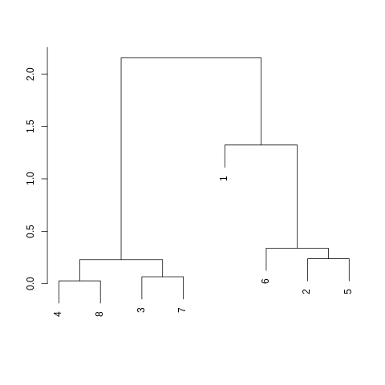

fun-gi: hamPCR + Douglas-fir + needle fungi
================
Kyle A. Gervers
2023-02-03

> This work is unpublished. All results shown are preliminary.

# Sections

- [hamPCR](#hampcr)
- [Overview](#overview)
- [Reproducibility](#reproducibility)
- [Installation](#installation)
- [Results](#results)

## hamPCR

[Return](#sections)

Host-associated microbe PCR (hamPCR) is a metabarcoding technique
developed by [Derek Lundberg *et
al.*](https://elifesciences.org/articles/66186) for quantifying
microbial load in or on host tissues. Using a pair of host-specific
primers to produce amplicons of a slightly different size (80-120 bp)
relative to the target microbial amplicon, investigators can safely
create a host reference internal to each sample that doesn’t swamp the
more important microbial signal. After sequencing, dividing the count of
microbial reads in each sample by the count of host reads creates and
index of microbial load that’s comparable across samples. This microbial
load index can also be examined for every microbial taxonomic unit,
allowing investigators to examine which taxa have loads that are
positively or negatively correlated with each other and which samples
have more or less compositionally similar loads.

Notably, this is an improvement compared to methods which use the
relative abundances of taxonomic units to describe communities. Because
relative abundances are always constrained to sum to one, a *real
increase or decrease* in the abundance of any taxonomic feature
necessitates an *artifactual decrease or increase* in the relative
abundance of all other features (and no, the order of “increase” and
“decrease” was not swapped here). This means that relative
abundance-based analyses are unable to distinguish between scenarios in
which one taxonomic feature increases in actual abundance or in which
all other taxonomic features decrease. While this downside to relative
abundance analyses does not represent an inherent shortcoming if
microbial ecologists adjust their interpretations appropriately, this
adjustment is likely more of a compromise than is currently appreciated.
For example, most ecologists are interested in knowing how a taxon
responds to a meaningful environmental gradient or treatment. If the
relative abundance of a taxon generally increases as the gradient
increases in intensity, it’s unclear whether this result represents an
outcome in which the taxon increasingly *prefers* a condition along a
gradient or whether *other taxa simply prefer it less*. Further, unless
microbial ecologists employ other means of estimating microbial load
(qPCR, CFUs, cell-sorting, etc.), they generally cannot investigate
fundamental phenomena centered around productivity, e.g.,
productivity-diversity relationships. hamPCR, similar to other
“spike-in” approaches, represents a more achievable way to estimate
microbial load while at the same time censusing the microbial community
of interest.

## Overview

[Return](#sections)

Following the protocol described by Lundberg *et al.*, a primer pair was
designed (Gi) that amplfies a portion of *Gigantea* coding sequence in
coastal Douglas-fir (*Pseudotsuga menziesii* var. *menziesii*, PSME).
This amplicon is \~100 bp larger than most amplicons produced with the
fungal-specific primers 5.8S-Fun and ITS4-Fun (Fun), designed by [D. Lee
Taylor *et al.*
2016](https://journals.asm.org/doi/10.1128/AEM.02576-16). Using this
size difference, the primer concentration of Gi primers was optimized.
To test whether or not fungal load calculations derived from this
technique were reliable, PCRs were performed along a standard curve of
*Nothophaeocryptopus gaeumannii* (NOGA) DNA serially diluted in PSME
DNA. Additionally, 8 samples of pooled needle DNA extractions (DFSSMT
samples) were included to predict where an average sample might fall
along the standard curve.

Further, with the expectation of a future need to extend the number of
barcode indices for multiplexing samples prior to sequencing, the 3-9 bp
frameshift regions in each primer were incorporated into the
multiplexing strategy. To account for the limited number of samples
included on this run, frameshift combinations were randomly assigned to
samples. Knowing that high indel rates could erode the fidelity of this
multiplexing scheme, all pairwise combinations of forward and reverse
frameshifts were used in demultiplexing. All samples were sequenced on
an Illumina MiSeq using a 500-cycle (2x250 bp) Nano reagent kit with v2
chemistry.

## Reproducibility

[Return](#sections)

All packages were installed and managed with `conda`.

    conda 22.11.1
    name: base
    channels:
      - conda-forge
      - bioconda
      - defaults
    dependencies:
      - fastqc=0.11.9
      - r-base=4.2.2
      - multiqc=1.13
      - gh=2.21.2
      - pheniqs=2.1.0
      - libgit2=1.5.0
      - git=2.39.0
      - itsx=1.1.3
      - cutadapt=4.2
      - vsearch=2.22.1
      - bioconductor-dada2=1.26.0
      - r-remotes=2.4.2
      - r-dplyr=1.0.10
      - atropos=1.1.31
      - r-rmarkdown=2.20
      - r-markdown=1.4
      - r-caret=6.0_93
      - r-vegan=2.6_4
    prefix: /home/gerverska/projects/fun-gi/env

## Installation

[Return](#sections)

Install the above bioinformatic environment from `config.yml` using the
script `00-build.sh`

    # First clone the repository (using the gh CLI tool here) ####
    gh repo clone gerverska/fun-gi

    # Then run the build script ####
    bash code/00-build.sh

A `make` implementation is on the horizon…

## Results

[Return](#sections)

- [Demultiplex](#demultiplex)
- [Trim](#trim)
- [Denoise](#denoise)
- [Compile](#compile)
- [Rarefy](#rarefy)
- [Analyze](#analyze)

Descriptions are ongoing.

### Demultiplex

[Results](#results)

#### Pheniqs demultiplexing

Expand

    {
        "incoming": {
            "count": 485439,
            "pf count": 485439,
            "pf fraction": 1.0
        },
        "sample": {
            "average classified confidence": 0.995882770326565,
            "average classified distance": 0.056203126625495,
            "average pf classified confidence": 0.999996737820934,
            "average pf classified distance": 0.044144460694003,
            "classified": [
                {
                    "BC": "TAAGGCGA-CTCTCTAT",
                    "ID": "TAAGGCGACTCTCTAT",
                    "PU": "TAAGGCGACTCTCTAT",
                    "average confidence": 0.992583341903079,
                    "average distance": 0.08173554350317,
                    "average pf confidence": 0.999992960508943,
                    "average pf distance": 0.057718947206402,
                    "barcode": [
                        "TAAGGCGA",
                        "CTCTCTAT"
                    ],
                    "concentration": 0.034615384615384,
                    "count": 13091,
                    "estimated concentration": 0.026863814066185,
                    "index": 1,
                    "low conditional confidence count": 2220,
                    "low confidence count": 97,
                    "pf count": 12994,
                    "pf fraction": 0.992590329233824,
                    "pf pooled classified fraction": 0.03084936658373,
                    "pf pooled fraction": 0.03084936658373,
                    "pooled classified fraction": 0.03095179549259,
                    "pooled fraction": 0.026967342961731
                },
                {
                    "BC": "CGTACTAG-CTCTCTAT",
                    "ID": "CGTACTAGCTCTCTAT",
                    "PU": "CGTACTAGCTCTCTAT",
                    "average confidence": 0.994717680500571,
                    "average distance": 0.056995097775144,
                    "average pf confidence": 0.999996983651887,
                    "average pf distance": 0.041538044949905,
                    "barcode": [
                        "CGTACTAG",
                        "CTCTCTAT"
                    ],
                    "concentration": 0.034615384615384,
                    "count": 18563,
                    "estimated concentration": 0.038174567241197,
                    "index": 2,
                    "low conditional confidence count": 2020,
                    "low confidence count": 98,
                    "pf count": 18465,
                    "pf fraction": 0.994720680924419,
                    "pf pooled classified fraction": 0.043838198704677,
                    "pf pooled fraction": 0.043838198704677,
                    "pooled classified fraction": 0.043889556162932,
                    "pooled fraction": 0.038239614040075
                },
                {
                    "BC": "AGGCAGAA-CTCTCTAT",
                    "ID": "AGGCAGAACTCTCTAT",
                    "PU": "AGGCAGAACTCTCTAT",
                    "average confidence": 0.993635236411458,
                    "average distance": 0.064078923105292,
                    "average pf confidence": 0.999997009753983,
                    "average pf distance": 0.042590702421824,
                    "barcode": [
                        "AGGCAGAA",
                        "CTCTCTAT"
                    ],
                    "concentration": 0.034615384615384,
                    "count": 10846,
                    "estimated concentration": 0.022280385115536,
                    "index": 3,
                    "low conditional confidence count": 2928,
                    "low confidence count": 69,
                    "pf count": 10777,
                    "pf fraction": 0.99363820763415,
                    "pf pooled classified fraction": 0.025585933790431,
                    "pf pooled fraction": 0.025585933790431,
                    "pooled classified fraction": 0.025643814369615,
                    "pooled fraction": 0.022342663032842
                },
                {
                    "BC": "TCCTGAGC-CTCTCTAT",
                    "ID": "TCCTGAGCCTCTCTAT",
                    "PU": "TCCTGAGCCTCTCTAT",
                    "average confidence": 0.99031219056888,
                    "average distance": 0.080303749406739,
                    "average pf confidence": 0.99999414623245,
                    "average pf distance": 0.047829004121537,
                    "barcode": [
                        "TCCTGAGC",
                        "CTCTCTAT"
                    ],
                    "concentration": 0.034615384615384,
                    "count": 10535,
                    "estimated concentration": 0.021569199026667,
                    "index": 4,
                    "low conditional confidence count": 4770,
                    "low confidence count": 102,
                    "pf count": 10433,
                    "pf fraction": 0.99031798766018,
                    "pf pooled classified fraction": 0.024769235152228,
                    "pf pooled fraction": 0.024769235152228,
                    "pooled classified fraction": 0.024908499389995,
                    "pooled fraction": 0.021702005813294
                },
                {
                    "BC": "GGACTCCT-CTCTCTAT",
                    "ID": "GGACTCCTCTCTCTAT",
                    "PU": "GGACTCCTCTCTCTAT",
                    "average confidence": 0.993005307011426,
                    "average distance": 0.081369776939993,
                    "average pf confidence": 0.999995536571184,
                    "average pf distance": 0.056394842996124,
                    "barcode": [
                        "GGACTCCT",
                        "CTCTCTAT"
                    ],
                    "concentration": 0.034615384615384,
                    "count": 12732,
                    "estimated concentration": 0.026138156167368,
                    "index": 5,
                    "low conditional confidence count": 5565,
                    "low confidence count": 89,
                    "pf count": 12643,
                    "pf fraction": 0.99300973923971,
                    "pf pooled classified fraction": 0.03001604907789,
                    "pf pooled fraction": 0.03001604907789,
                    "pooled classified fraction": 0.030102991384283,
                    "pooled fraction": 0.026227806171321
                },
                {
                    "BC": "TAGGCATG-CTCTCTAT",
                    "ID": "TAGGCATGCTCTCTAT",
                    "PU": "TAGGCATGCTCTCTAT",
                    "average confidence": 0.995426509524237,
                    "average distance": 0.063869560702045,
                    "average pf confidence": 0.999996020887729,
                    "average pf distance": 0.049295774647887,
                    "barcode": [
                        "TAGGCATG",
                        "CTCTCTAT"
                    ],
                    "concentration": 0.034615384615384,
                    "count": 19258,
                    "estimated concentration": 0.039632085243095,
                    "index": 6,
                    "low conditional confidence count": 4664,
                    "low confidence count": 88,
                    "pf count": 19170,
                    "pf fraction": 0.995430470453837,
                    "pf pooled classified fraction": 0.045511956088203,
                    "pf pooled fraction": 0.045511956088203,
                    "pooled classified fraction": 0.045532784172049,
                    "pooled fraction": 0.039671307826524
                },
                {
                    "BC": "CTCTCTAC-CTCTCTAT",
                    "ID": "CTCTCTACCTCTCTAT",
                    "PU": "CTCTCTACCTCTCTAT",
                    "average confidence": 0.994112675344305,
                    "average distance": 0.063799621928166,
                    "average pf confidence": 0.999993756035123,
                    "average pf distance": 0.045742657933657,
                    "barcode": [
                        "CTCTCTAC",
                        "CTCTCTAT"
                    ],
                    "concentration": 0.034615384615384,
                    "count": 19044,
                    "estimated concentration": 0.039140043704866,
                    "index": 7,
                    "low conditional confidence count": 3482,
                    "low confidence count": 112,
                    "pf count": 18932,
                    "pf fraction": 0.994118882587691,
                    "pf pooled classified fraction": 0.044946914588516,
                    "pf pooled fraction": 0.044946914588516,
                    "pooled classified fraction": 0.045026811806652,
                    "pooled fraction": 0.039230469739761
                },
                {
                    "BC": "CGAGGCTG-CTCTCTAT",
                    "ID": "CGAGGCTGCTCTCTAT",
                    "PU": "CGAGGCTGCTCTCTAT",
                    "average confidence": 0.994809624235609,
                    "average distance": 0.064481904986443,
                    "average pf confidence": 0.999996450099617,
                    "average pf distance": 0.047991468183434,
                    "barcode": [
                        "CGAGGCTG",
                        "CTCTCTAT"
                    ],
                    "concentration": 0.034615384615384,
                    "count": 8483,
                    "estimated concentration": 0.01744680059293,
                    "index": 8,
                    "low conditional confidence count": 894,
                    "low confidence count": 44,
                    "pf count": 8439,
                    "pf fraction": 0.994813155723211,
                    "pf pooled classified fraction": 0.020035231999392,
                    "pf pooled fraction": 0.020035231999392,
                    "pooled classified fraction": 0.020056839138617,
                    "pooled fraction": 0.017474904158915
                },
                {
                    "BC": "TCTCTCTC-GTCACAGT",
                    "ID": "TCTCTCTCGTCACAGT",
                    "PU": "TCTCTCTCGTCACAGT",
                    "average confidence": 0.994784662927791,
                    "average distance": 0.067400066672727,
                    "average pf confidence": 0.999997243644427,
                    "average pf distance": 0.054683929931454,
                    "barcode": [
                        "TCTCTCTC",
                        "GTCACAGT"
                    ],
                    "concentration": 0.034615384615384,
                    "count": 32997,
                    "estimated concentration": 0.067862451648649,
                    "index": 9,
                    "low conditional confidence count": 373,
                    "low confidence count": 172,
                    "pf count": 32825,
                    "pf fraction": 0.994787404915598,
                    "pf pooled classified fraction": 0.077930618601735,
                    "pf pooled fraction": 0.077930618601735,
                    "pooled classified fraction": 0.078016682901917,
                    "pooled fraction": 0.067973524994901
                },
                {
                    "BC": "CGAACGAA-GTCACAGT",
                    "ID": "CGAACGAAGTCACAGT",
                    "PU": "CGAACGAAGTCACAGT",
                    "average confidence": 0.997423140369594,
                    "average distance": 0.047173740203687,
                    "average pf confidence": 0.999997624087383,
                    "average pf distance": 0.040121465173657,
                    "barcode": [
                        "CGAACGAA",
                        "GTCACAGT"
                    ],
                    "concentration": 0.034615384615384,
                    "count": 26413,
                    "estimated concentration": 0.054465690439715,
                    "index": 10,
                    "low conditional confidence count": 334,
                    "low confidence count": 68,
                    "pf count": 26345,
                    "pf fraction": 0.997425510165448,
                    "pf pooled classified fraction": 0.062546295416991,
                    "pf pooled fraction": 0.062546295416991,
                    "pooled classified fraction": 0.062449757416987,
                    "pooled fraction": 0.054410543858239
                },
                {
                    "BC": "CACAGTCA-GTCACAGT",
                    "ID": "CACAGTCAGTCACAGT",
                    "PU": "CACAGTCAGTCACAGT",
                    "average confidence": 0.997320309988289,
                    "average distance": 0.035196866269189,
                    "average pf confidence": 0.999998955769751,
                    "average pf distance": 0.028677872119216,
                    "barcode": [
                        "CACAGTCA",
                        "GTCACAGT"
                    ],
                    "concentration": 0.034615384615384,
                    "count": 34719,
                    "estimated concentration": 0.071585841608107,
                    "index": 11,
                    "low conditional confidence count": 448,
                    "low confidence count": 93,
                    "pf count": 34626,
                    "pf fraction": 0.997321351421411,
                    "pf pooled classified fraction": 0.082206415832557,
                    "pf pooled fraction": 0.082206415832557,
                    "pooled classified fraction": 0.08208810539357,
                    "pooled fraction": 0.071520829599599
                },
                {
                    "BC": "AGGTCTAC-GTCACAGT",
                    "ID": "AGGTCTACGTCACAGT",
                    "PU": "AGGTCTACGTCACAGT",
                    "average confidence": 0.997348026018819,
                    "average distance": 0.039590063495599,
                    "average pf confidence": 0.999999243797853,
                    "average pf distance": 0.032815082875396,
                    "barcode": [
                        "AGGTCTAC",
                        "GTCACAGT"
                    ],
                    "concentration": 0.034615384615384,
                    "count": 44885,
                    "estimated concentration": 0.092549292018383,
                    "index": 12,
                    "low conditional confidence count": 446,
                    "low confidence count": 119,
                    "pf count": 44766,
                    "pf fraction": 0.997348780216107,
                    "pf pooled classified fraction": 0.106280032667945,
                    "pf pooled fraction": 0.106280032667945,
                    "pooled classified fraction": 0.106124157106783,
                    "pooled fraction": 0.092462698711887
                },
                {
                    "BC": "GTACTGGT-CTTGGTAG",
                    "ID": "GTACTGGTCTTGGTAG",
                    "PU": "GTACTGGTCTTGGTAG",
                    "average confidence": 0.996343373298746,
                    "average distance": 0.07096210212372,
                    "average pf confidence": 0.999994301225264,
                    "average pf distance": 0.060693641618497,
                    "barcode": [
                        "GTACTGGT",
                        "CTTGGTAG"
                    ],
                    "concentration": 0.034615384615384,
                    "count": 19447,
                    "estimated concentration": 0.040057969935848,
                    "index": 13,
                    "low conditional confidence count": 6271,
                    "low confidence count": 71,
                    "pf count": 19376,
                    "pf fraction": 0.996349051267547,
                    "pf pooled classified fraction": 0.046001025621545,
                    "pf pooled fraction": 0.046001025621545,
                    "pooled classified fraction": 0.045979647616255,
                    "pooled fraction": 0.040060646136795
                },
                {
                    "BC": "TGTCGACA-CTTGGTAG",
                    "ID": "TGTCGACACTTGGTAG",
                    "PU": "TGTCGACACTTGGTAG",
                    "average confidence": 0.998431059431249,
                    "average distance": 0.050660410149461,
                    "average pf confidence": 0.999995181195371,
                    "average pf distance": 0.045648389904264,
                    "barcode": [
                        "TGTCGACA",
                        "CTTGGTAG"
                    ],
                    "concentration": 0.034615384615384,
                    "count": 23016,
                    "estimated concentration": 0.047508884657607,
                    "index": 14,
                    "low conditional confidence count": 3493,
                    "low confidence count": 36,
                    "pf count": 22980,
                    "pf fraction": 0.998435870698644,
                    "pf pooled classified fraction": 0.054557368331085,
                    "pf pooled fraction": 0.054557368331085,
                    "pooled classified fraction": 0.054418037205519,
                    "pooled fraction": 0.047412754228646
                },
                {
                    "BC": "AGAGACAC-CTTGGTAG",
                    "ID": "AGAGACACCTTGGTAG",
                    "PU": "AGAGACACCTTGGTAG",
                    "average confidence": 0.997038619573882,
                    "average distance": 0.044014084507042,
                    "average pf confidence": 0.999996355272575,
                    "average pf distance": 0.035598248340161,
                    "barcode": [
                        "AGAGACAC",
                        "CTTGGTAG"
                    ],
                    "concentration": 0.034615384615384,
                    "count": 14200,
                    "estimated concentration": 0.029270269320383,
                    "index": 15,
                    "low conditional confidence count": 2648,
                    "low confidence count": 42,
                    "pf count": 14158,
                    "pf fraction": 0.997042253521126,
                    "pf pooled classified fraction": 0.033612846859508,
                    "pf pooled fraction": 0.033612846859508,
                    "pooled classified fraction": 0.033573867236634,
                    "pooled fraction": 0.02925187304687
                },
                {
                    "BC": "AGCAAGGT-CTTGGTAG",
                    "ID": "AGCAAGGTCTTGGTAG",
                    "PU": "AGCAAGGTCTTGGTAG",
                    "average confidence": 0.998391073692307,
                    "average distance": 0.043764785400473,
                    "average pf confidence": 0.999996339868168,
                    "average pf distance": 0.038503850385038,
                    "barcode": [
                        "AGCAAGGT",
                        "CTTGGTAG"
                    ],
                    "concentration": 0.034615384615384,
                    "count": 11836,
                    "estimated concentration": 0.024430482593513,
                    "index": 16,
                    "low conditional confidence count": 4430,
                    "low confidence count": 19,
                    "pf count": 11817,
                    "pf fraction": 0.998394727948631,
                    "pf pooled classified fraction": 0.028055022696624,
                    "pf pooled fraction": 0.028055022696624,
                    "pooled classified fraction": 0.027984527648788,
                    "pooled fraction": 0.024382054181884
                },
                {
                    "BC": "CTTGCTTG-CTTGGTAG",
                    "ID": "CTTGCTTGCTTGGTAG",
                    "PU": "CTTGCTTGCTTGGTAG",
                    "average confidence": 0.993911478416935,
                    "average distance": 0.055688319212108,
                    "average pf confidence": 0.999994433913257,
                    "average pf distance": 0.040947176684881,
                    "barcode": [
                        "CTTGCTTG",
                        "CTTGGTAG"
                    ],
                    "concentration": 0.034615384615384,
                    "count": 13809,
                    "estimated concentration": 0.028375084505033,
                    "index": 17,
                    "low conditional confidence count": 2955,
                    "low confidence count": 84,
                    "pf count": 13725,
                    "pf fraction": 0.993917010645231,
                    "pf pooled classified fraction": 0.03258485118991,
                    "pf pooled fraction": 0.03258485118991,
                    "pooled classified fraction": 0.032649403709203,
                    "pooled fraction": 0.028446416542552
                },
                {
                    "BC": "GGTAGCAA-CTTGGTAG",
                    "ID": "GGTAGCAACTTGGTAG",
                    "PU": "GGTAGCAACTTGGTAG",
                    "average confidence": 0.99742023490636,
                    "average distance": 0.071603727317312,
                    "average pf confidence": 0.999995013631994,
                    "average pf distance": 0.063368162261831,
                    "barcode": [
                        "GGTAGCAA",
                        "CTTGGTAG"
                    ],
                    "concentration": 0.034615384615384,
                    "count": 16312,
                    "estimated concentration": 0.033636621121813,
                    "index": 18,
                    "low conditional confidence count": 1890,
                    "low confidence count": 42,
                    "pf count": 16270,
                    "pf fraction": 0.997425208435507,
                    "pf pooled classified fraction": 0.03862699663824,
                    "pf pooled fraction": 0.03862699663824,
                    "pooled classified fraction": 0.038567388898871,
                    "pooled fraction": 0.033602574164828
                },
                {
                    "BC": "AGAGACAC-GTCACAGT",
                    "ID": "AGAGACACGTCACAGT",
                    "PU": "AGAGACACGTCACAGT",
                    "average confidence": 0.996735207450991,
                    "average distance": 0.042661627440874,
                    "average pf confidence": 0.999999248978321,
                    "average pf distance": 0.033953809031368,
                    "barcode": [
                        "AGAGACAC",
                        "GTCACAGT"
                    ],
                    "concentration": 0.034615384615384,
                    "count": 17463,
                    "estimated concentration": 0.035985189136219,
                    "index": 19,
                    "low conditional confidence count": 1095,
                    "low confidence count": 57,
                    "pf count": 17406,
                    "pf fraction": 0.996735956021302,
                    "pf pooled classified fraction": 0.041324001443467,
                    "pf pooled fraction": 0.041324001443467,
                    "pooled classified fraction": 0.041288763630517,
                    "pooled fraction": 0.035973623874472
                },
                {
                    "BC": "AGCAAGGT-GTCACAGT",
                    "ID": "AGCAAGGTGTCACAGT",
                    "PU": "AGCAAGGTGTCACAGT",
                    "average confidence": 0.99742482593274,
                    "average distance": 0.04788764385221,
                    "average pf confidence": 0.999999020868349,
                    "average pf distance": 0.039775315014422,
                    "barcode": [
                        "AGCAAGGT",
                        "GTCACAGT"
                    ],
                    "concentration": 0.034615384615384,
                    "count": 26416,
                    "estimated concentration": 0.054471892643979,
                    "index": 20,
                    "low conditional confidence count": 315,
                    "low confidence count": 68,
                    "pf count": 26348,
                    "pf fraction": 0.997425802543912,
                    "pf pooled classified fraction": 0.062553417788835,
                    "pf pooled fraction": 0.062553417788835,
                    "pooled classified fraction": 0.06245685048753,
                    "pooled fraction": 0.054416723831418
                },
                {
                    "BC": "CTTGCTTG-GTCACAGT",
                    "ID": "CTTGCTTGGTCACAGT",
                    "PU": "CTTGCTTGGTCACAGT",
                    "average confidence": 0.991661403479869,
                    "average distance": 0.061457887986318,
                    "average pf confidence": 0.999998285293991,
                    "average pf distance": 0.040094848027592,
                    "barcode": [
                        "CTTGCTTG",
                        "GTCACAGT"
                    ],
                    "concentration": 0.034615384615384,
                    "count": 9356,
                    "estimated concentration": 0.01918135038526,
                    "index": 21,
                    "low conditional confidence count": 153,
                    "low confidence count": 78,
                    "pf count": 9278,
                    "pf fraction": 0.991663103890551,
                    "pf pooled classified fraction": 0.022027121991984,
                    "pf pooled fraction": 0.022027121991984,
                    "pooled classified fraction": 0.022120922666616,
                    "pooled fraction": 0.01927327635398
                },
                {
                    "BC": "GGTAGCAA-GTCACAGT",
                    "ID": "GGTAGCAAGTCACAGT",
                    "PU": "GGTAGCAAGTCACAGT",
                    "average confidence": 0.996990573003608,
                    "average distance": 0.06447135035089,
                    "average pf confidence": 0.999998202362143,
                    "average pf distance": 0.0546875,
                    "barcode": [
                        "GGTAGCAA",
                        "GTCACAGT"
                    ],
                    "concentration": 0.034615384615384,
                    "count": 12967,
                    "estimated concentration": 0.026727365572391,
                    "index": 22,
                    "low conditional confidence count": 361,
                    "low confidence count": 39,
                    "pf count": 12928,
                    "pf fraction": 0.996992365234826,
                    "pf pooled classified fraction": 0.030692674403145,
                    "pf pooled fraction": 0.030692674403145,
                    "pooled classified fraction": 0.030658615243481,
                    "pooled fraction": 0.026711904070336
                },
                {
                    "BC": "TCTCTCTC-CTTGGTAG",
                    "ID": "TCTCTCTCCTTGGTAG",
                    "PU": "TCTCTCTCCTTGGTAG",
                    "average confidence": 0.986441006735191,
                    "average distance": 0.12136409227683,
                    "average pf confidence": 0.999981376426014,
                    "average pf distance": 0.07727503812913,
                    "barcode": [
                        "TCTCTCTC",
                        "CTTGGTAG"
                    ],
                    "concentration": 0.034615384615384,
                    "count": 1994,
                    "estimated concentration": 0.004066578595366,
                    "index": 23,
                    "low conditional confidence count": 4527,
                    "low confidence count": 27,
                    "pf count": 1967,
                    "pf fraction": 0.986459378134403,
                    "pf pooled classified fraction": 0.004669901806233,
                    "pf pooled fraction": 0.004669901806233,
                    "pooled classified fraction": 0.004714527554214,
                    "pooled fraction": 0.004107622172919
                },
                {
                    "BC": "CGAACGAA-CTTGGTAG",
                    "ID": "CGAACGAACTTGGTAG",
                    "PU": "CGAACGAACTTGGTAG",
                    "average confidence": 0.996500453543878,
                    "average distance": 0.071522023549934,
                    "average pf confidence": 0.999989295394359,
                    "average pf distance": 0.060831509846827,
                    "barcode": [
                        "CGAACGAA",
                        "CTTGGTAG"
                    ],
                    "concentration": 0.034615384615384,
                    "count": 2293,
                    "estimated concentration": 0.004724012247286,
                    "index": 24,
                    "low conditional confidence count": 1534,
                    "low confidence count": 8,
                    "pf count": 2285,
                    "pf fraction": 0.996511120802442,
                    "pf pooled classified fraction": 0.005424873221781,
                    "pf pooled fraction": 0.005424873221781,
                    "pooled classified fraction": 0.005421470251662,
                    "pooled fraction": 0.004723559499751
                },
                {
                    "BC": "CACAGTCA-CTTGGTAG",
                    "ID": "CACAGTCACTTGGTAG",
                    "PU": "CACAGTCACTTGGTAG",
                    "average confidence": 0.995460675240547,
                    "average distance": 0.050855991943605,
                    "average pf confidence": 0.999992362684737,
                    "average pf distance": 0.036418816388467,
                    "barcode": [
                        "CACAGTCA",
                        "CTTGGTAG"
                    ],
                    "concentration": 0.034615384615384,
                    "count": 1986,
                    "estimated concentration": 0.004087252609577,
                    "index": 25,
                    "low conditional confidence count": 2149,
                    "low confidence count": 9,
                    "pf count": 1977,
                    "pf fraction": 0.995468277945619,
                    "pf pooled classified fraction": 0.004693643045716,
                    "pf pooled fraction": 0.004693643045716,
                    "pooled classified fraction": 0.004695612699433,
                    "pooled fraction": 0.004091142244442
                },
                {
                    "BC": "AGGTCTAC-CTTGGTAG",
                    "ID": "AGGTCTACCTTGGTAG",
                    "PU": "AGGTCTACCTTGGTAG",
                    "average confidence": 0.968634539829152,
                    "average distance": 0.177700348432055,
                    "average pf confidence": 0.999993211981894,
                    "average pf distance": 0.064748201438848,
                    "barcode": [
                        "AGGTCTAC",
                        "CTTGGTAG"
                    ],
                    "concentration": 0.034615384615384,
                    "count": 287,
                    "estimated concentration": 0.000574737595074,
                    "index": 26,
                    "low conditional confidence count": 2526,
                    "low confidence count": 9,
                    "pf count": 278,
                    "pf fraction": 0.968641114982578,
                    "pf pooled classified fraction": 0.000660006457617,
                    "pf pooled fraction": 0.000660006457617,
                    "pooled classified fraction": 0.000678570415275,
                    "pooled fraction": 0.000591217434116
                }
            ],
            "classified count": 422948,
            "classified fraction": 0.871269098692111,
            "classified pf fraction": 0.995886019085088,
            "count": 485439,
            "estimated noise": 0.129193982207943,
            "index": 0,
            "low conditional confidence count": 62491,
            "low confidence count": 1740,
            "pf classified count": 421208,
            "pf classified fraction": 1.0,
            "pf count": 421208,
            "pf fraction": 0.86768471424834,
            "unclassified": {
                "ID": "undetermined",
                "PU": "undetermined",
                "count": 62491,
                "index": 0,
                "pf count": 0,
                "pf fraction": 0.0,
                "pf pooled fraction": 0.0,
                "pooled classified fraction": 0.147751023766515,
                "pooled fraction": 0.128730901307888
            }
        }
    }

#### 

Out of 485,439 read pairs (reads) obtained from the sequencing run,
128,919 reads (27%) were demultiplexed with indices used in this
experiment. Overall, 62,491 reads (13%) could not be demultiplexed to
any expected index pair. This large proportion of undemultiplexed reads
was investigated further.

### Trim

[Results](#results)

#### Cutadapt primer trimming

Expand

    This is cutadapt 4.2 with Python 3.10.8
    Command line parameters: -e 0.1 --no-indels -j 32 --discard-untrimmed -g ^file:scratch/rev-adapters.fa -o scratch/trim2/P01-02-D-n09_gi_fwd-{name}-R2.fq.gz -p scratch/trim2/P01-02-D-n09_gi_fwd-{name}-R1.fq.gz scratch/trim1/P01-02-D-n09_gi_fwd-R2.fq.gz scratch/trim1/P01-02-D-n09_gi_fwd-R1.fq.gz
    Processing paired-end reads on 32 cores ...
    Finished in 0.288 s (9282.220 µs/read; 0.01 M reads/minute).

    === Summary ===

    Total read pairs processed:                 31
      Read 1 with adapter:                       1 (3.2%)
    Pairs written (passing filters):             1 (3.2%)

    Total basepairs processed:        14,601 bp
      Read 1:         7,781 bp
      Read 2:         6,820 bp
    Total written (filtered):            444 bp (3.0%)
      Read 1:           224 bp
      Read 2:           220 bp

    === First read: Adapter n01_fun_rev ===

    Sequence: NAACTTTYRRCAAYGGATCWCT; Type: anchored 5'; Length: 22; Trimmed: 0 times

    === First read: Adapter n02_fun_rev ===

    Sequence: NNAACTTTYRRCAAYGGATCWCT; Type: anchored 5'; Length: 23; Trimmed: 0 times

    === First read: Adapter n03_fun_rev ===

    Sequence: NNNAACTTTYRRCAAYGGATCWCT; Type: anchored 5'; Length: 24; Trimmed: 0 times

    === First read: Adapter n04_fun_rev ===

    Sequence: NNNNAACTTTYRRCAAYGGATCWCT; Type: anchored 5'; Length: 25; Trimmed: 0 times

    === First read: Adapter n05_fun_rev ===

    Sequence: NNNNNAACTTTYRRCAAYGGATCWCT; Type: anchored 5'; Length: 26; Trimmed: 0 times

    === First read: Adapter n06_fun_rev ===

    Sequence: NNNNNNAACTTTYRRCAAYGGATCWCT; Type: anchored 5'; Length: 27; Trimmed: 0 times

    === First read: Adapter n07_fun_rev ===

    Sequence: NNNNNNNAACTTTYRRCAAYGGATCWCT; Type: anchored 5'; Length: 28; Trimmed: 0 times

    === First read: Adapter n08_fun_rev ===

    Sequence: NNNNNNNNAACTTTYRRCAAYGGATCWCT; Type: anchored 5'; Length: 29; Trimmed: 0 times

    === First read: Adapter n04_gi_rev ===

    Sequence: NNNNATGCCTGAGCACAAACAG; Type: anchored 5'; Length: 22; Trimmed: 0 times

    === First read: Adapter n05_gi_rev ===

    Sequence: NNNNNATGCCTGAGCACAAACAG; Type: anchored 5'; Length: 23; Trimmed: 0 times

    === First read: Adapter n06_gi_rev ===

    Sequence: NNNNNNATGCCTGAGCACAAACAG; Type: anchored 5'; Length: 24; Trimmed: 0 times

    === First read: Adapter n07_gi_rev ===

    Sequence: NNNNNNNATGCCTGAGCACAAACAG; Type: anchored 5'; Length: 25; Trimmed: 0 times

    === First read: Adapter n08_gi_rev ===

    Sequence: NNNNNNNNATGCCTGAGCACAAACAG; Type: anchored 5'; Length: 26; Trimmed: 0 times

    === First read: Adapter n09_gi_rev ===

    Sequence: NNNNNNNNNATGCCTGAGCACAAACAG; Type: anchored 5'; Length: 27; Trimmed: 1 times

    No. of allowed errors: 1

    Overview of removed sequences
    length  count   expect  max.err error counts
    27  1   0.0 1   1

    === First read: Adapter n10_gi_rev ===

    Sequence: NNNNNNNNNNATGCCTGAGCACAAACAG; Type: anchored 5'; Length: 28; Trimmed: 0 times

    === First read: Adapter n11_gi_rev ===

    Sequence: NNNNNNNNNNNATGCCTGAGCACAAACAG; Type: anchored 5'; Length: 29; Trimmed: 0 times

#### Atropos overlap trimming

Expand

    2023-01-27 12:24:26,567 INFO: This is Atropos 1.1.31 with Python 3.10.8
    2023-01-27 12:24:26,574 INFO: Trimming 2 adapters with at most 10.0% errors in paired-end mode ...
    2023-01-27 12:24:26,610 INFO: Starting 31 worker processes
    2023-01-27 12:24:26,683 INFO: Starting 1 worker processes
    =======
    Atropos
    =======

    Atropos version: 1.1.31
    Python version: 3.10.8
    Command line parameters: trim -e 0.1 --aligner insert --insert-match-error-rate 0.2 -T 32 -a AGWGATCCRTTGYYRAAAGTT -A AYTTAAGCATATCAATAAGCGGAGG -o 02-trim/P01-01-C-n04_fun_fwd-n01_fun_rev-rc-R1.fq.gz -p 02-trim/P01-01-C-n04_fun_fwd-n01_fun_rev-rc-R2.fq.gz -pe1 scratch/trim2/P01-01-C-n04_fun_fwd-n01_fun_rev-R1.fq.gz -pe2 scratch/trim2/P01-01-C-n04_fun_fwd-n01_fun_rev-R2.fq.gz

    Sample ID: P01-01-C-n04_fun_fwd-n01_fun_rev-R
    Input format: FASTQ, Paired, w/ Qualities
    Input files:
      /nfs1/BPP/Spatafora_Lab/gerversk/projects/fun-gi/scratch/trim2/P01-01-C-n04_fun_fwd-n01_fun_rev-R1.fq.gz
      /nfs1/BPP/Spatafora_Lab/gerversk/projects/fun-gi/scratch/trim2/P01-01-C-n04_fun_fwd-n01_fun_rev-R2.fq.gz

    Start time: 2023-01-27T12:24:26.570431
    Wallclock time: 0.11 s (109267 us/read; 0.00 M reads/minute)
    CPU time (main process): 0.11 s

    --------
    Trimming
    --------

    Pairs                               records fraction
    ----------------------------------- ------- --------
    Total read pairs processed:            1
      Read 1 with adapter:                 0    0
      Read 2 with adapter:                 0    0
    Pairs written (passing filters):       1 100.0%

    Base pairs                            bp fraction
    ----------------------------------- ---- --------
    Total bp processed:                  451
      Read 1:                            222
      Read 2:                            229
    Total bp written (filtered):         451 100.0%
      Read 1:                            222 100.0%
      Read 2:                            229 100.0%

    ---------------------
    First read: Adapter 1
    ---------------------

    Sequence              Type       Length Trimmed (x)
    --------------------- ---------- ------ -----------
    AGWGATCCRTTGYYRAAAGTT regular 3'     21           0

    ----------------------
    Second read: Adapter 2
    ----------------------

    Sequence                  Type       Length Trimmed (x)
    ------------------------- ---------- ------ -----------
    AYTTAAGCATATCAATAAGCGGAGG regular 3'     25           0

    2023-01-27 12:24:38,204 INFO: This is Atropos 1.1.31 with Python 3.10.8
    2023-01-27 12:24:38,211 INFO: Trimming 2 adapters with at most 10.0% errors in paired-end mode ...
    2023-01-27 12:24:38,249 INFO: Starting 31 worker processes
    2023-01-27 12:24:38,325 INFO: Starting 1 worker processes
    =======
    Atropos
    =======

    Atropos version: 1.1.31
    Python version: 3.10.8
    Command line parameters: trim -e 0.1 --aligner insert --insert-match-error-rate 0.2 -T 32 -a CTGTTTGTGCTCAGGCAT -A GAGGTAGATATTCCAGAACACG -o 02-trim/P01-01-C-n07_gi_fwd-n06_gi_rev-rc-R1.fq.gz -p 02-trim/P01-01-C-n07_gi_fwd-n06_gi_rev-rc-R2.fq.gz -pe1 scratch/trim2/P01-01-C-n07_gi_fwd-n06_gi_rev-R1.fq.gz -pe2 scratch/trim2/P01-01-C-n07_gi_fwd-n06_gi_rev-R2.fq.gz

    Sample ID: P01-01-C-n07_gi_fwd-n06_gi_rev-R
    Input format: FASTQ, Paired, w/ Qualities
    Input files:
      /nfs1/BPP/Spatafora_Lab/gerversk/projects/fun-gi/scratch/trim2/P01-01-C-n07_gi_fwd-n06_gi_rev-R1.fq.gz
      /nfs1/BPP/Spatafora_Lab/gerversk/projects/fun-gi/scratch/trim2/P01-01-C-n07_gi_fwd-n06_gi_rev-R2.fq.gz

    Start time: 2023-01-27T12:24:38.207855
    Wallclock time: 0.11 s (57120 us/read; 0.00 M reads/minute)
    CPU time (main process): 0.11 s

    --------
    Trimming
    --------

    Pairs                               records fraction
    ----------------------------------- ------- --------
    Total read pairs processed:            2
      Read 1 with adapter:                 0    0
      Read 2 with adapter:                 0    0
    Pairs written (passing filters):       2 100.0%

    Base pairs                            bp fraction
    ----------------------------------- ---- --------
    Total bp processed:                  898
      Read 1:                            444
      Read 2:                            454
    Total bp written (filtered):         898 100.0%
      Read 1:                            444 100.0%
      Read 2:                            454 100.0%

    ---------------------
    First read: Adapter 1
    ---------------------

    Sequence           Type       Length Trimmed (x)
    ------------------ ---------- ------ -----------
    CTGTTTGTGCTCAGGCAT regular 3'     18           0

    ----------------------
    Second read: Adapter 2
    ----------------------

    Sequence               Type       Length Trimmed (x)
    ---------------------- ---------- ------ -----------
    GAGGTAGATATTCCAGAACACG regular 3'     22           0

#### 

Although only certain combinations of frameshifted primers were used,
all pairwise combinations of potential frameshifts were used to trim Fun
and Gi reads. Additionally, shorter and longer frameshifts were also
used to identify instances were insertions and deletions in frameshift
sequences occurred. This approach initially inflates the number of
trimmed reads. Accordingly, a total of 89,707 reads (70% of
demultiplexed reads) where trimmed with Fun or Gi primers. 1,910 reads
among the 62,491 undemuliplexed reads (3%) could be trimmed with Fun or
Gi primers, suggesting that most potential reads were properly
demultiplexed in the previous step with Pheniqs.

### Denoise

[Results](#results)

#### DADA2 error-modeling

Expand

#### 

Sequence error correction (denoising) with DADA2 was performed
separately for Fun and Gi reads. Prior to quality filtering and
trimming, 72,673 reads (81%) had been trimmed with Fun primers, while
17,034 reads (19%) were trimmed with Gi primers. Filtering and trimming
retained most reads (Fun = 71,139, Gi = 16,780), but this loss continued
through denoising and read merging. Overall, Fun reads retained a
greater percentage of sequences (97%) than Gi reads (91%).

#### Frameshift trimming profiles

To examine the feasibility of frameshift indexing for larger libraries,
indel occurrence rate (i.e., the rate at which single or multiple
insertions and deletions occurred) was investigated using the shortest
and longest expected frameshift pairs associated with Fun and Gi
primers. Instances in which trimmed and denoised reads had shorter or
longer frameshifts than the shortest and longest expected frameshift
pairs were identified as instances of deletion and insertion,
respectively. Overall, 99% of Fun reads had expected frameshift pairs
used in this experiment, but this rate was lower (92%) for Gi reads.
Insertion occurrence rates were generally fairly low (Fun = 0.1%, Gi =
0.6%) relative to deletion occurrence rate (Fun = 1%, Gi = 6%), with Gi
reads generally experiencing higher rates of indels.

Retaining all denoised samples (even those which did not match any
expected frameshift pair), a total of 53 Fun amplicon sequencing
variants (ASVs) and 59 Gi ASVs were obtained. Many of these ASVs
belonged to non-target frameshifts, so these erroneous samples were not
retained in downstream analyses.

### Compile

[Results](#results)

#### LULU post-clustering of Fun ASVs

Expand

    ####processing: fun_OTU.1 #####
    ---hits: fun_OTU.3 
    ---hits: fun_OTU.4 
    ---hits: fun_OTU.5
    ---potential parent: 
    No parent found!

    ####processing: fun_OTU.3 #####
    ---hits: fun_OTU.1 
    ---hits: fun_OTU.4 
    ---hits: fun_OTU.5
    ---potential parent: fun_OTU.1
    ------checking: fun_OTU.1
    ------relative cooccurence: 1 which is sufficient!
    ------min avg abundance: 32.8 which is OK!
    SETTING fun_OTU.3 to be an ERROR of fun_OTU.1

    ####processing: fun_OTU.2 #####
    ---hits: 
    ---potential parent: 
    No parent found!

    ####processing: fun_OTU.4 #####
    ---hits: fun_OTU.1 
    ---hits: fun_OTU.3
    ---potential parent: fun_OTU.1 
    ---potential parent: fun_OTU.3
    ------checking: fun_OTU.1
    ------relative cooccurence: 1 which is sufficient!
    ------min avg abundance: 103.945945945946 which is OK!
    SETTING fun_OTU.4 to be an ERROR of fun_OTU.1

    ------checking: fun_OTU.3
    ####processing: fun_OTU.5 #####
    ---hits: fun_OTU.1 
    ---hits: fun_OTU.3
    ---potential parent: fun_OTU.1 
    ---potential parent: fun_OTU.3
    ------checking: fun_OTU.1
    ------relative cooccurence: 0
    ------checking: fun_OTU.3
    ------relative cooccurence: 0
    No parent found!

#### LULU post-clustering of Gi ASVs

Expand

    ####processing: gi_OTU.1 #####
    ---hits: gi_OTU.2 
    ---hits: gi_OTU.3
    ---potential parent: 
    No parent found!

    ####processing: gi_OTU.2 #####
    ---hits: gi_OTU.1 
    ---hits: gi_OTU.3
    ---potential parent: gi_OTU.1
    ------checking: gi_OTU.1
    ------relative cooccurence: 1 which is sufficient!
    ------min avg abundance: 2.20670391061453 which is OK!
    SETTING gi_OTU.2 to be an ERROR of gi_OTU.1

    ####processing: gi_OTU.3 #####
    ---hits: gi_OTU.1 
    ---hits: gi_OTU.2
    ---potential parent: gi_OTU.1 
    ---potential parent: gi_OTU.2
    ------checking: gi_OTU.1
    ------relative cooccurence: 1 which is sufficient!
    ------min avg abundance: 10.8850574712644 which is OK!
    SETTING gi_OTU.3 to be an ERROR of gi_OTU.1

    ------checking: gi_OTU.2

#### 

To group merged ASVs into ideally less artifactual operational taxonomic
units (OTUs) Fun and Gi ASVs were post-clustered with the
co-occurrence-informed LULU algorithm. In order for a less abundant
“child” ASV to cluster with a more abundant “parent” ASV, the child
needed to occur with the parent in 95% of samples. Fun ASV sequences
also needed to have 97% similarity to investigate child-parent status,
while 85% similarity was permitted for Gi ASVs. These percentages were
not thoroughly investigated, and higher similarity thresholds will
likely be tolerated. After clustering, only 3 Fun OTUs were retained.
The most abundant OTU (OTU.1) was assigned to NOGA (*Nothophaeocryptopus
gaeumannii*, bootstrap support = 95%). This was followed by OTU.2, which
was assigned to *Zasmidium pseudotsugae* with 97% bootstrap support. A
third OTU was also assigned to NOGA with lower support (81%), but this
OTU occurred as a single read in a single negative control sample. Only
one other negative control sample was contaminated with a single OTU.1
read. As expected, a single Gi OTU was obtained after clustering.

### Rarefy

[Results](#results)

#### Sequencing bias prior to rarefaction

#### 

For each sample, a load index for each Fun OTU was calculated as the
quotient of the number of reads associated with that Fun OTU divided by
the number of reads associated with the single Gi OTU in that sample. To
investigate bias in sequencing depth, the relationship between the load
of NOGA (assigned to OTU.1) and the proportion of NOGA DNA diluted into
PSME DNA was examined across samples associated with this standard
curve. This relationship suggested that dilutions containing greater
amounts of NOGA DNA were generally sequenced to greater depths compared
to samples with less NOGA DNA. Given this, a rarefaction-based approach
(involving repeated subsampling and averaging) was pursued in downstream
analysis of the standard curve.

All samples were randomly subsampled 1,000 times to a depth of 740 reads
when read depth allowed. This depth was only partially explored, but it
was chosen because it was the depth necessary to recover Gi reads from
all subsamples (necessary to create a rarefied calculation of load). Out
of 36, 27 had sufficient sequencing depth. Most samples that failed were
among with the 8 samples of pooled needle DNA extractions (DFSSMT
samples). Interpretation of these samples proceeded using non-rarefied
estimates of load. These failures were likely due to known issues with
amplification relative to samples involved in the NOGA standard curve.

### Analyze

[Results](#results)

#### Base model

    Regress NOGA load onto known NOGA dilution, without accounting for Fun + Gi frameshifts

    base <- lm(log10(mean_noga_load) ~ log10(dilution), standard)

#### Full model

    Regress NOGA load onto known NOGA dilution, treating Fun + Gi frameshifts as random effects

    library(nlme)

    full <- lme(log10(mean_noga_load) ~ log10(dilution),
                random = list(fun_n = ~ 1, gi_n = ~ 1),
                data = standard,
                method = 'ML',
                na.action = na.omit)

| Full model residuals                                  | Fun frameshift random intercepts                    | Gi frameshift random intercepts (nested within Fun) |
|-------------------------------------------------------|-----------------------------------------------------|-----------------------------------------------------|
|  |  |    |

#### 

To test whether hamPCR-derived load calculations were incapable of
represented known biological reality, fixed and mixed effect linear
regression was performed with samples derived from the standard curve.
Both full (mixed effect) and base (fixed effect) models included the
proportion of NOGA DNA as an a fixed-effect, independent variable. The
full model included Fun and Gi frameshift pairs as 4-level random
effects. With more samples, each level of NOGA dilution would have
samples associated with all combinations of Fun and Gi pairs (16) in
order to investigate them as a fixed effect. Unfortunately, the effect
of frameshift pair could only be accounted for with a mixed effect
model. Full and base models were compared with a likelihood ratio test.
The simplest model was retained if the null hypothesis could not be
rejected. Leave-one-out cross-validation (LOOCV) was performed to
investigate the sensitivity of this model to missing samples. Model
residuals were also retained for further investigation.

### NOGA load regressed on NOGA dilution

### Base model residuals associated with each frameshift pair

### Comparing DFSSMT samples with relative abundance and fungal load data

#### Raw metrics

#### Hierarchical clustering

| Relative abundance                   | Log-transformed load                     |
|--------------------------------------|------------------------------------------|
|  |  |
