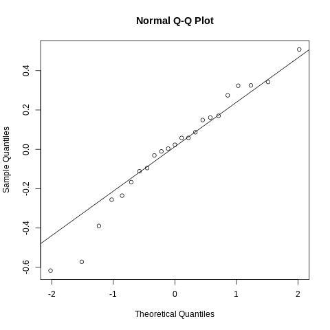

fun-gi: hamPCR + Douglas-fir + needle fungi
================
Kyle A. Gervers
2023-01-31

> This work is unpublished. All results shown are preliminary.

## What’s hamPCR?

Host-associated microbe PCR (hamPCR) is a metabarcoding technique
developed by [Derek Lundberg *et
al.*](https://elifesciences.org/articles/66186) for quantifying
microbial load in or on host tissues. Using a pair of host-specific
primers to produce amplicons of a slightly different size (80-120 bp)
relative to the target microbial amplicon, investigators can safely
create a host reference internal to each sample that doesn’t swamp the
more important microbial signal. After sequencing, dividing the count of
microbial reads in each sample by the count of host reads creates and
index of microbial load that’s comparable across samples. This microbial
load index can also be examined for every microbial taxonomic unit,
allowing investigators to examine which taxa have loads that are
positively or negatively correlated with each other and which samples
have more or less compositionally similar loads.

Notably, this is an improvement compared to methods which use the
relative abundances of taxonomic units to describe communities. Because
relative abundances are always constrained to sum to one, a *real
increase or decrease* in the abundance of any taxonomic feature
necessitates an *artifactual decrease or increase* in the relative
abundance of all other features (and no, the order of “increase” and
“decrease” was not swapped here). This means that relative
abundance-based analyses are unable to distinguish between scenarios in
which one taxonomic feature increases in actual abundance or in which
all other taxonomic features decrease. While this downside to relative
abundance analyses does not represent an inherent shortcoming if
microbial ecologists adjust their interpretations appropriately, this
adjustment is likely more of a compromise than is currently appreciated.
For example, most ecologists are interested in knowing how a taxon
responds to a meaningful environmental gradient or treatment. If the
relative abundance of a taxon generally increases as the gradient
increases in intensity, it’s unclear whether this result represents an
outcome in which the taxon increasingly *prefers* a condition along a
gradient or whether *other taxa simply prefer it less*. Further, unless
microbial ecologists employ other means of estimating microbial load
(qPCR, CFUs, cell-sorting, etc.), they generally cannot investigate
fundamental phenomena centered around productivity, e.g.,
productivity-diversity relationships. hamPCR, similar to other
“spike-in” approaches, represents a more achievable way to estimate
microbial load while at the same time censusing the microbial community
of interest.

## What is this project?

Following the protocol described by Lundberg *et al.*, a primer pair was
designed (Gi) that amplfies a portion of *Gigantea* coding sequence in
coastal Douglas-fir (*Pseudotsuga menziesii* var. *menziesii*, PSME).
This amplicon is \~100 bp larger than most amplicons produced with the
fungal-specific primers 5.8S-Fun and ITS4-Fun (Fun), designed by [D. Lee
Taylor *et al.*
2016](https://journals.asm.org/doi/10.1128/AEM.02576-16). Using this
size difference, the primer concentration of Gi primers was optimized.
To test whether or not fungal load calculations derived from this
technique were reliable, PCRs were performed along a standard curve of
*Nothophaeocryptopus gaeumannii* (NOGA) DNA serially diluted in PSME
DNA. Additionally, 8 samples of pooled needle DNA extractions (DFSSMT
samples) were included to predict where an average sample might fall
along the standard curve.

Further, with the expectation of a future need to extend the number of
barcode indices for multiplexing samples prior to sequencing, the 3-9 bp
frameshift regions in each primer were incorporated into the
multiplexing strategy. To account for the limited number of samples
included on this run, frameshift combinations were randomly assigned to
samples. Knowing that high indel rates could erode the fidelity of this
multiplexing scheme, all pairwise combinations of forward and reverse
frameshifts were used in demultiplexing. All samples were sequenced on
an Illumina MiSeq using a 500-cycle (2x250 bp) Nano reagent kit with v2
chemistry.

## Reproducibility

All packages were installed and managed with `conda`.

    ## conda 22.11.1
    ## name: base
    ## channels:
    ##   - conda-forge
    ##   - bioconda
    ##   - defaults
    ## dependencies:
    ##   - fastqc=0.11.9
    ##   - r-base=4.2.2
    ##   - multiqc=1.13
    ##   - gh=2.21.2
    ##   - pheniqs=2.1.0
    ##   - libgit2=1.5.0
    ##   - git=2.39.0
    ##   - itsx=1.1.3
    ##   - cutadapt=4.2
    ##   - vsearch=2.22.1
    ##   - bioconductor-dada2=1.26.0
    ##   - r-remotes=2.4.2
    ##   - r-dplyr=1.0.10
    ##   - atropos=1.1.31
    ##   - r-rmarkdown=2.20
    ##   - r-markdown=1.4
    ## prefix: /home/gerverska/projects/fun-gi/env

## Installation

Install the above bioinformatic environment from `config.yml` using the
script `00-build.sh`

    # First clone the repository (using the gh CLI tool here) ####
    gh repo clone gerverska/fun-gi

    # Then run the build script ####
    bash code/00-build.sh

A `make` implementation is on the horizon…

## Figures

Descriptions are coming soon.

### DADA2 error modeling

### Sequencing depth along the NOGA:PSME DNA standard curve

### Checking assumptions when modeling NOGA load against NOGA DNA dilution

#### Base model residuals

#### Full model residuals (a) and Fun (b) + Gi (c) frameshift random intercepts

a  b
 c

### NOGA load modeled against NOGA DNA dilution

### Base model residuals associated with each frameshift pair

