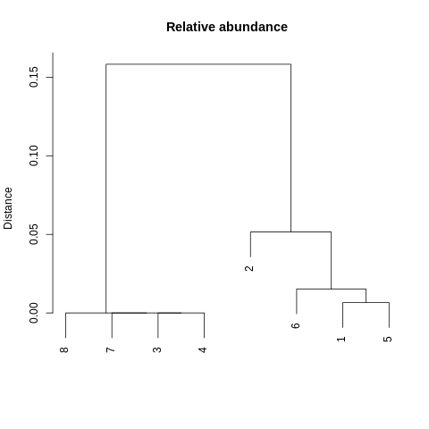
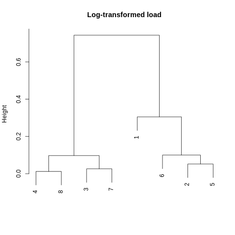

```{r setup, include=FALSE}
knitr::opts_chunk$set(echo = F, include = F)
```

> This work is unpublished. All results shown are preliminary.

# Sections
* [hamPCR](#hampcr)
* [Overview](#overview)
* [Reproducibility](#reproducibility)
* [Installation](#installation)
* [Results](#results)

## hamPCR
[Return](#sections)

Host-associated microbe PCR (hamPCR) is a metabarcoding technique developed by [Derek Lundberg *et al.*](https://elifesciences.org/articles/66186) for quantifying microbial load in or on host tissues. Using a pair of host-specific primers to produce amplicons of a slightly different size (80-120 bp) relative to the target microbial amplicon, investigators can safely create a host reference internal to each sample that doesn't swamp the more important microbial signal. After sequencing, dividing the count of microbial reads in each sample by the count of host reads creates and index of microbial load that's comparable across samples. This microbial load index can also be examined for every microbial taxonomic unit, allowing investigators to examine which taxa have loads that are positively or negatively correlated with each other and which samples have more or less compositionally similar loads. 

Notably, this is an improvement compared to methods which use the relative abundances of taxonomic units to describe communities. Because relative abundances are always constrained to sum to one, a *real increase or decrease* in the abundance of any taxonomic feature necessitates an *artifactual decrease or increase* in the relative abundance of all other features (and no, the order of "increase" and "decrease" was not swapped here). This means that relative abundance-based analyses are unable to distinguish between scenarios in which one taxonomic feature increases in actual abundance or in which all other taxonomic features decrease. While this downside to relative abundance analyses does not represent an inherent shortcoming if microbial ecologists adjust their interpretations appropriately, this adjustment is likely more of a compromise than is currently appreciated. For example, most ecologists are interested in knowing how a taxon responds to a meaningful environmental gradient or treatment. If the relative abundance of a taxon generally increases as the gradient increases in intensity, it's unclear whether this result represents an outcome in which the taxon increasingly *prefers* a condition along a gradient or whether *other taxa simply prefer it less*. Further, unless microbial ecologists employ other means of estimating microbial load (qPCR, CFUs, cell-sorting, etc.), they generally cannot investigate fundamental phenomena centered around productivity, e.g., productivity-diversity relationships. hamPCR, similar to other "spike-in" approaches, represents a more achievable way to estimate microbial load while at the same time censusing the microbial community of interest.

## Overview
[Return](#sections)

Following the protocol described by Lundberg *et al.*, a primer pair was designed (Gi) that amplfies a portion of *Gigantea* coding sequence in coastal Douglas-fir (*Pseudotsuga menziesii* var. *menziesii*, PSME). This amplicon is ~100 bp larger than most amplicons produced with the fungal-specific primers 5.8S-Fun and ITS4-Fun (Fun), designed by [D. Lee Taylor *et al.* 2016](https://journals.asm.org/doi/10.1128/AEM.02576-16). Using this size difference, the primer concentration of Gi primers was optimized. To test whether or not fungal load calculations derived from this technique were reliable, PCRs were performed along a standard curve of *Nothophaeocryptopus gaeumannii* (NOGA) DNA serially diluted in PSME DNA. Additionally, 8 samples of pooled needle DNA extractions (DFSSMT samples) were included to predict where an average sample might fall along the standard curve.

Further, with the expectation of a future need to extend the number of barcode indices for multiplexing samples prior to sequencing, the 3-9 bp frameshift regions in each primer were incorporated into the multiplexing strategy. To account for the limited number of samples included on this run, frameshift combinations were randomly assigned to samples. Knowing that high indel rates could erode the fidelity of this multiplexing scheme, all pairwise combinations of forward and reverse frameshifts were used in demultiplexing. All samples were sequenced on an Illumina MiSeq using a 500-cycle (2x250 bp) Nano reagent kit with v2 chemistry.

## Reproducibility
[Return](#sections)

All packages were installed and managed with `conda`.
```{bash conda, include=TRUE, echo=FALSE, comment=""}

conda --version
cat config.yml

```
## Installation
[Return](#sections)

Install the above bioinformatic environment from `config.yml` using the script `00-build.sh`
```
# First clone the repository (using the gh CLI tool here) ####
gh repo clone gerverska/fun-gi

# Then run the build script ####
bash code/00-build.sh
```
A `make` implementation is on the horizon...

## Results
[Return](#sections)

- [Demultiplex](#demultiplex)
- [Trim](#trim)
- [Denoise](#denoise)
- [Compile](#compile)
- [Rarefy](#rarefy)
- [Analyze](#analyze)

Descriptions are ongoing.

### Demultiplex
[Results](#results)

#### Pheniqs demultiplexing

<details>
  <summary>Expand</summary>
```{bash pheniqs, include=TRUE, echo=FALSE, comment=""}

cat 01-demultiplex/logs/pheniqs.txt

```
</details>

```{r demultiplex, include=TRUE}

demultiplex <- read.table(file.path('01-demultiplex', 'logs', 'R1_data', 'multiqc_general_stats.txt'), header = T) 
total <- demultiplex |> subset(select = FastQC_mqc.generalstats.fastqc.total_sequences) |> sum()
undeter <- demultiplex |> subset(Sample == 'undetermined-R1', select = FastQC_mqc.generalstats.fastqc.total_sequences) |> sum()

study <- read.table(file.path('01-demultiplex', 'logs', 'reads.txt'), header = T) |> subset(select = reads) |> sum()

perc.study <- (study / total) |> round(digits = 2) * 100
perc.undeter <- (undeter / total) |> round(digits = 2) * 100

```

####

Out of `r total |> formatC(format = 'd', big.mark = ',')` read pairs (reads) obtained from the sequencing run, `r study |> formatC(format = 'd', big.mark = ',')` reads (`r perc.study`%) were demultiplexed with indices used in this experiment. Overall, `r undeter |> formatC(format = 'd', big.mark = ',')` reads (`r perc.undeter`%) could not be demultiplexed to any expected index pair. This large proportion of undemultiplexed reads was investigated further.

### Trim
[Results](#results)

#### Cutadapt primer trimming

<details>
  <summary>Expand</summary>
```{bash cutadapt, include=TRUE, echo=FALSE, comment=""}

cat 02-trim/logs/trim2-cutadapt.txt

```
</details>

#### Atropos overlap trimming
<details>
  <summary>Expand</summary>
```{bash atropos, include=TRUE, echo=FALSE, comment=""}

cat 02-trim/logs/trim3-atropos-fun.txt 02-trim/logs/trim3-atropos-gi.txt

```
</details>

```{r trim, include=TRUE}

trim <- read.table(file.path('02-trim', 'logs', 'trim3-reads.txt'), header = T) |>
    subset(select = reads) |> sum()
trim.error <- read.table(file.path('02-trim', 'logs', 'trim-error-reads.txt'), header = T) |>
    subset(select = trimmed) |> sum()

perc.trim <- (trim / study) |> round(digits = 2) * 100
perc.trim.error <- (trim.error / undeter) |> round(digits = 2) * 100

```

####

Although only certain combinations of frameshifted primers were used, all pairwise combinations of potential frameshifts were used to trim Fun and Gi reads. Additionally, shorter and longer frameshifts were also used to identify instances were insertions and deletions in frameshift sequences occurred. This approach initially inflates the number of trimmed reads. Accordingly, a total of `r trim |> formatC(format = 'd', big.mark = ',')` reads (`r perc.trim`% of demultiplexed reads) where trimmed with Fun or Gi primers. `r trim.error |> formatC(format = 'd', big.mark = ',')` reads among the `r undeter |> formatC(format = 'd', big.mark = ',')` undemuliplexed reads (`r perc.trim.error`%) could be trimmed with Fun or Gi primers, suggesting that most potential reads were properly demultiplexed in the previous step with Pheniqs.

### Denoise
[Results](#results)

#### DADA2 error-modeling

<details>
  <summary>Expand</summary>
  
```{r error.model, include=TRUE, warning=FALSE, fig.align='center', fig.width=12}
library(ggplot2)
library(patchwork)

fun.error.fwd <- readRDS(file.path('03-denoise', 'logs', 'fun-error-fwd.rds'))
fun.error.rev <- readRDS(file.path('03-denoise', 'logs', 'fun-error-rev.rds'))

gi.error.fwd <- readRDS(file.path('03-denoise', 'logs', 'gi-error-fwd.rds'))
gi.error.rev <- readRDS(file.path('03-denoise', 'logs', 'gi-error-rev.rds'))

fun.error.fwd + fun.error.rev

gi.error.fwd + gi.error.rev

```  
</details>

####

```{r denoise, include=TRUE}

fun.denoise <- read.table(file.path('03-denoise', 'logs', 'fun-reads.txt'), header = T) |>
    subset(select = -sample) |> colSums(na.rm = T)
gi.denoise <- read.table(file.path('03-denoise', 'logs', 'gi-reads.txt'), header = T) |> 
    subset(select = -sample) |> colSums(na.rm = T)

perc.fun <- (fun.denoise[[1]] / trim) |> round(digits = 2) * 100
perc.gi <- (gi.denoise[[1]] / trim) |> round(digits = 2) * 100

perc.fun.merge <- (fun.denoise[[5]] / fun.denoise[[1]]) |> round(digits = 2) * 100
perc.gi.merge <- (gi.denoise[[5]] / gi.denoise[[1]]) |> round(digits = 2) * 100

fun.indel <- read.table(file.path('03-denoise', 'logs', 'fun-indel.txt'), header = T)
gi.indel <- read.table(file.path('03-denoise', 'logs', 'gi-indel.txt'), header = T)

perc.fun.exp <- (fun.indel$correct / fun.indel$total) |> round(digits = 2) * 100
perc.gi.exp <- (gi.indel$correct / gi.indel$total) |> round(digits = 2) * 100

perc.in.fun <- (fun.indel$insertions / fun.indel$in.correct) |> round(digits = 3) * 100
perc.in.gi <- (gi.indel$insertions / gi.indel$in.correct) |> round(digits = 3) * 100

perc.del.fun <- (fun.indel$deletions / fun.indel$del.correct) |> round(digits = 2) * 100
perc.del.gi <- (gi.indel$deletions / gi.indel$del.correct) |> round(digits = 2) * 100

fun.asv <- readRDS(file.path('03-denoise', 'fun-seq-tab.rds')) |>
    colnames() |> length()
gi.asv <- readRDS(file.path('03-denoise', 'gi-seq-tab.rds')) |>
    colnames() |> length()

```

Sequence error correction (denoising) with DADA2 was performed separately for Fun and Gi reads. Prior to quality filtering and trimming, `r fun.denoise[[1]] |> formatC(format = 'd', big.mark = ',')` reads (`r perc.fun`%) had been trimmed with Fun primers, while `r gi.denoise[[1]] |> formatC(format = 'd', big.mark = ',')` reads (`r perc.gi`%) were trimmed with Gi primers. Filtering and trimming retained most reads (Fun = `r fun.denoise[[2]] |> formatC(format = 'd', big.mark = ',')`, Gi = `r gi.denoise[[2]] |> formatC(format = 'd', big.mark = ',')`), but this loss continued through denoising and read merging. Overall, Fun reads retained a greater percentage of sequences (`r perc.fun.merge`%) than Gi reads (`r perc.gi.merge`%).

#### Frameshift trimming profiles

```{r frameshift, include=TRUE, message=FALSE, warning=FALSE, fig.align='center', fig.width=12}

fun.frameshift <- readRDS(file.path('03-denoise', 'fun-frameshift.rds')) + scale_y_log10() + ylab('Log( total reads )')
gi.frameshift <- readRDS(file.path('03-denoise', 'gi-frameshift.rds')) + scale_y_log10() + ylab('Log( total reads )')

fun.frameshift + gi.frameshift

```

To examine the feasibility of frameshift indexing for larger libraries, indel occurrence rate (i.e., the rate at which single or multiple insertions and deletions occurred) was investigated using the shortest and longest expected frameshift pairs associated with Fun and Gi primers. Instances in which trimmed and denoised reads had shorter or longer frameshifts than the shortest and longest expected frameshift pairs were identified as instances of deletion and insertion, respectively. Overall, `r perc.fun.exp`% of Fun reads had expected frameshift pairs used in this experiment, but this rate was lower (`r perc.gi.exp`%) for Gi reads. Insertion occurrence rates were generally fairly low (Fun = `r perc.in.fun`%, Gi = `r perc.in.gi`%) relative to deletion occurrence rate (Fun = `r perc.del.fun`%, Gi = `r perc.del.gi`%), with Gi reads generally experiencing higher rates of indels.

Retaining all denoised samples (even those which did not match any expected frameshift pair), a total of `r fun.asv |> formatC(format = 'd', big.mark = ',')` Fun amplicon sequencing variants (ASVs) and `r gi.asv |> formatC(format = 'd', big.mark = ',')` Gi ASVs were obtained. Many of these ASVs belonged to non-target frameshifts, so these erroneous samples were not retained in downstream analyses.

### Compile
[Results](#results)

#### LULU post-clustering of Fun ASVs
<details>
  <summary>Expand</summary>
```{bash fun-compile, include=TRUE, echo=FALSE, comment=""}

cat 04-compile/logs/fun-lulu.txt

```
</details>

#### LULU post-clustering of Gi ASVs
<details>
  <summary>Expand</summary>
```{bash gi-compile, include=TRUE, echo=FALSE, comment=""}

cat 04-compile/logs/gi-lulu.txt

```
</details>

####

```{r compile, include=TRUE}

fun.lulu <- readRDS(file.path('04-compile', 'fun-lulu.rds'))
fun.otu <- fun.lulu$tab |> colnames() |> length()
fun.boot <- fun.lulu$boot
noga <- fun.boot[1, 7]
zaps <- fun.boot[2, 7]
art <- fun.boot[3, 7]
gi.lulu <- readRDS(file.path('04-compile', 'gi-lulu.rds'))
gi.otu <- gi.lulu$tab |> colnames() |> length()

```

To group merged ASVs into ideally less artifactual operational taxonomic units (OTUs) Fun and Gi ASVs were post-clustered with the co-occurrence-informed LULU algorithm. In order for a less abundant "child" ASV to cluster with a more abundant "parent" ASV, the child needed to occur with the parent in 95% of samples. Fun ASV sequences also needed to have 97% similarity to investigate child-parent status, while 85% similarity was permitted for Gi ASVs. These percentages were not thoroughly investigated, and higher similarity thresholds will likely be tolerated. After clustering, only `r fun.otu |> formatC(format = 'd', big.mark = ',')` Fun OTUs were retained. The most abundant OTU (OTU.1) was assigned to NOGA (*Nothophaeocryptopus gaeumannii*, bootstrap support = `r noga`%). This was followed by OTU.2, which was assigned to *Zasmidium pseudotsugae* with `r zaps`% bootstrap support. A third OTU was also assigned to NOGA with lower support (`r art`%), but this OTU occurred as a single read in a single negative control sample. Only one other negative control sample was contaminated with a single OTU.1 read. As expected, a single Gi OTU was obtained after clustering.

### Rarefy
[Results](#results)

#### Sequencing bias prior to rarefaction

```{r bias, include=TRUE, message=FALSE, warning=FALSE, fig.align='center', fig.width=9}

readRDS(file.path('05-rarefy', 'logs', 'bias.rds'))

```

```{r rare, include=TRUE}

rare <- readRDS(file.path('05-rarefy', 'fun-gi.rds'))
target <- rare$depth
depth.test <- rare$tab |> rowSums() > target
samples <- depth.test |> length()
pass <- depth.test[depth.test == T] |> length()

subsamples <- 1000  # Need to add an element that reports the number of sub-samples!!!

```

####

For each sample, a load index for each Fun OTU was calculated as the quotient of the number of reads associated with that Fun OTU divided by the number of reads associated with the single Gi OTU in that sample. To investigate bias in sequencing depth, the relationship between the load of NOGA (assigned to OTU.1) and the proportion of NOGA DNA diluted into PSME DNA was examined across samples associated with this standard curve. This relationship suggested that dilutions containing greater amounts of NOGA DNA were generally sequenced to greater depths compared to samples with less NOGA DNA. Given this, a rarefaction-based approach (involving repeated subsampling and averaging) was pursued in downstream analysis of the standard curve.

All samples were randomly subsampled `r subsamples |> formatC(format = 'd', big.mark = ',')` times to a depth of `r target |> formatC(format = 'd', big.mark = ',')` reads when read depth allowed. This depth was only partially explored, but it was chosen because it was the depth necessary to recover Gi reads from all subsamples (necessary to create a rarefied calculation of load). Out of `r samples |> formatC(format = 'd', big.mark = ',')`, `r pass |> formatC(format = 'd', big.mark = ',')` had sufficient sequencing depth. Most samples that failed were among with the 8 samples of pooled needle DNA extractions (DFSSMT samples). Interpretation of these samples proceeded using non-rarefied estimates of load. These failures were likely due to known issues with amplification relative to samples involved in the NOGA standard curve.

### Analyze
[Results](#results)

#### Base model

```
Regress NOGA load onto known NOGA dilution, without accounting for Fun + Gi frameshifts

base <- lm(log10(mean_noga_load) ~ log10(dilution), standard)
```


#### Full model

```
Regress NOGA load onto known NOGA dilution, treating Fun + Gi frameshifts as random effects

library(nlme)

full <- lme(log10(mean_noga_load) ~ log10(dilution),
            random = list(fun_n = ~ 1, gi_n = ~ 1),
            data = standard,
            method = 'ML',
            na.action = na.omit)
```

| Full model residuals | Fun frameshift random intercepts | Gi frameshift random intercepts (nested within Fun) |
--- | --- | ---
 |  | 

####

To test whether hamPCR-derived load calculations were incapable of represented known biological reality, fixed and mixed effect linear regression was performed with samples derived from the standard curve. Both full (mixed effect) and base (fixed effect) models included the proportion of NOGA DNA as an a fixed-effect, independent variable. The full model included Fun and Gi frameshift pairs as 4-level random effects. With more samples, each level of NOGA dilution would have samples associated with all combinations of Fun and Gi pairs (16) in order to investigate them as a fixed effect. Unfortunately, the effect of frameshift pair could only be accounted for with a mixed effect model. Full and base models were compared with a likelihood ratio test. The simplest model was retained if the null hypothesis could not be rejected. Leave-one-out cross-validation (LOOCV) was performed to investigate the sensitivity of this model to missing samples. Model residuals were also retained for further investigation.

### NOGA load regressed on NOGA dilution

```{r load, include=TRUE, message=FALSE, warning=FALSE, fig.align='center', fig.width=10, fig.height=8}

readRDS(file.path('06-analyze', 'load.rds'))

```

### Base model residuals associated with each frameshift pair

```{r residuals, include=TRUE, message=FALSE, warning=FALSE, fig.align='center', fig.width=7, fig.height=6}

readRDS(file.path('06-analyze', 'residuals.rds'))

```

### Comparing DFSSMT samples with relative abundance and fungal load data

#### Raw metrics

```{r taxa, include=TRUE, message=FALSE, warning=FALSE, fig.align='center', fig.width=6, fig.height=8}

readRDS(file.path('06-analyze', 'taxa.rds'))

```

#### Hierarchical clustering

Relative abundance | Log-transformed load
--- | ---
 | 