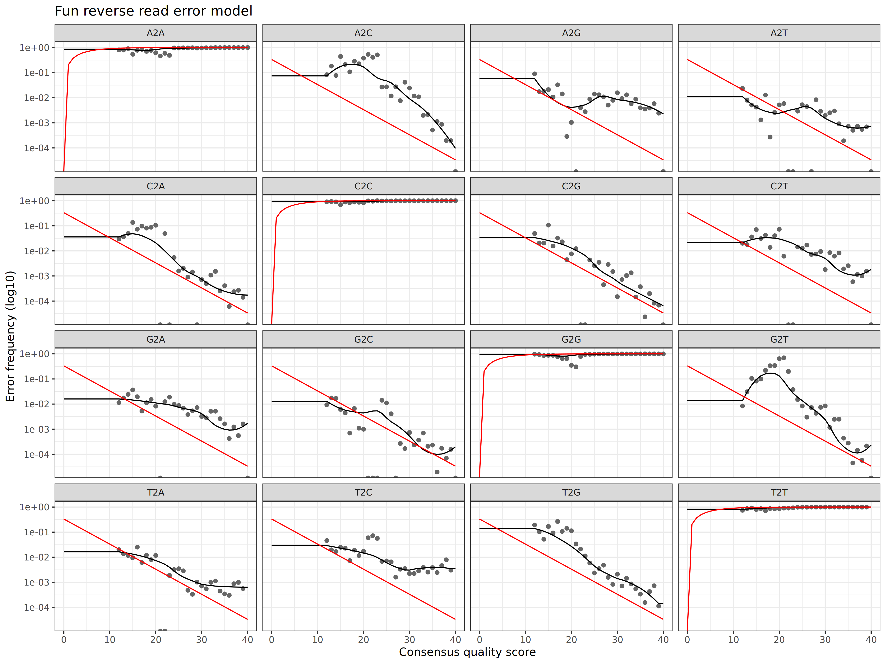
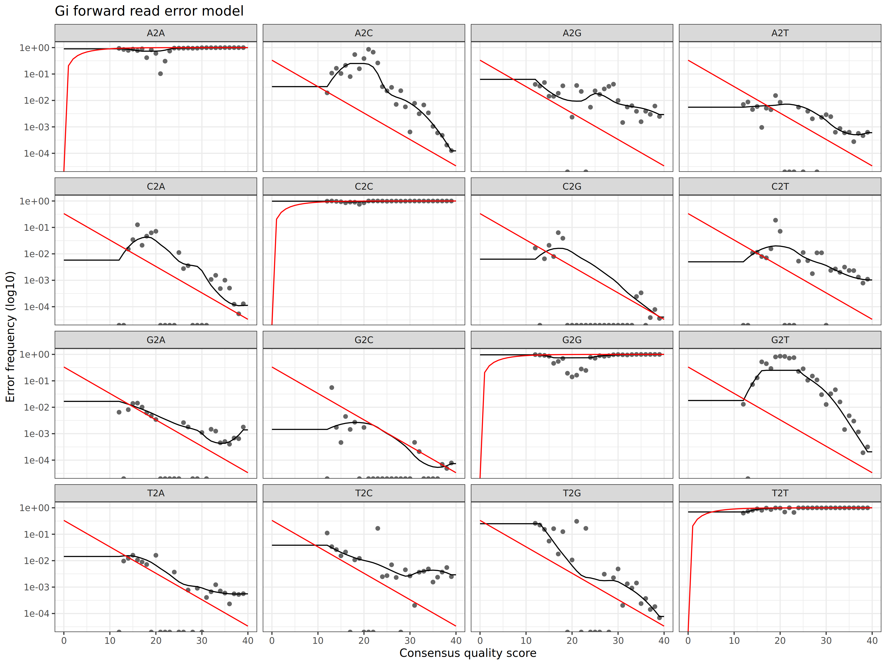
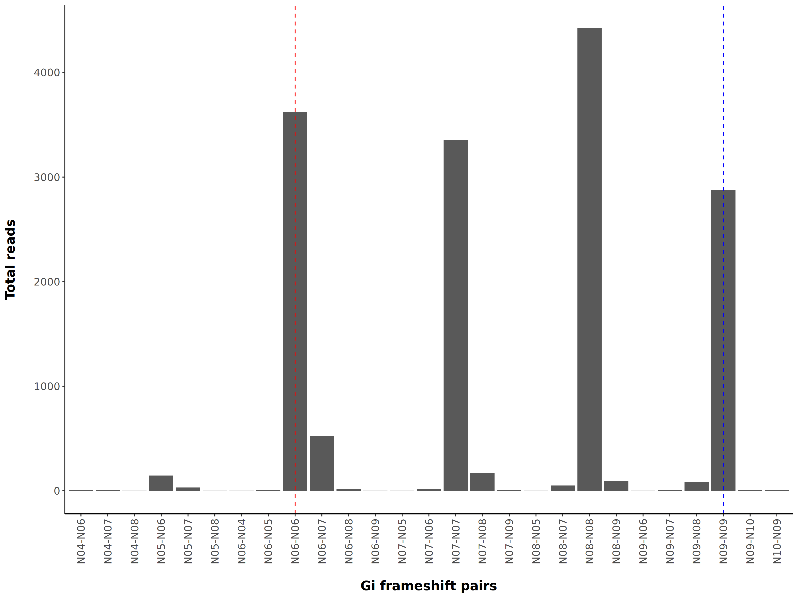
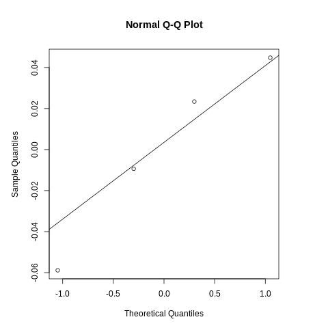
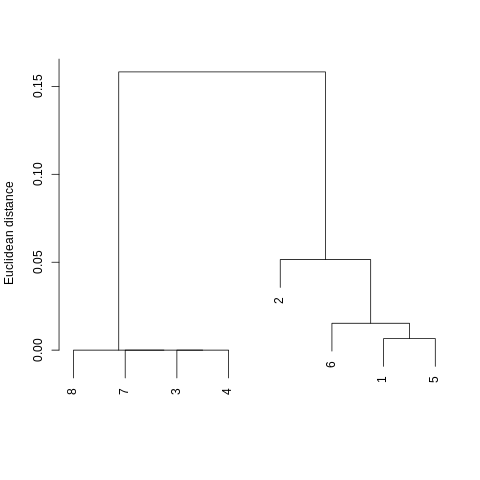

```{r setup, include=FALSE}
knitr::opts_chunk$set(echo = F, include = F)
```

> This work is unpublished. All results shown are preliminary.

# Sections
* [hamPCR](#hampcr)
* [Overview](#overview)
* [Reproducibility](#reproducibility)
* [Installation](#installation)
* [Methods](#methods)
* [Results](#results)

## hamPCR
[Return](#sections)

Host-associated microbe PCR (hamPCR) is a metabarcoding technique developed by [Derek Lundberg *et al.*](https://elifesciences.org/articles/66186) for quantifying microbial load in or on host tissues. Using a pair of host-specific primers to produce amplicons of a slightly different size (80-120 bp) relative to the target microbial amplicon, investigators can safely create a host reference internal to each sample that doesn't swamp the more important microbial signal. After sequencing, dividing the count of microbial reads in each sample by the count of host reads creates and index of microbial load that's comparable across samples. This microbial load index can also be examined for every microbial taxonomic unit, allowing investigators to examine which taxa have loads that are positively or negatively correlated with each other and which samples have more or less compositionally similar loads. 

Notably, this is an improvement compared to methods which use the relative abundances of taxonomic units to describe communities. Because relative abundances are always constrained to sum to one, a *real increase or decrease* in the abundance of any taxonomic feature necessitates an *artifactual decrease or increase* in the relative abundance of all other features (and no, the order of "increase" and "decrease" was not swapped here). This means that relative abundance-based analyses are unable to distinguish between scenarios in which one taxonomic feature increases in actual abundance or in which all other taxonomic features decrease. While this downside to relative abundance analyses does not represent an inherent shortcoming if microbial ecologists adjust their interpretations appropriately, this adjustment is likely more of a compromise than is currently appreciated. For example, most ecologists are interested in knowing how a taxon responds to a meaningful environmental gradient or treatment. If the relative abundance of a taxon generally increases as the gradient increases in intensity, it's unclear whether this result represents an outcome in which the taxon increasingly *prefers* a condition along a gradient or whether *other taxa simply prefer it less*. Further, unless microbial ecologists employ other means of estimating microbial load (qPCR, CFUs, cell-sorting, etc.), they generally cannot investigate fundamental phenomena centered around productivity, e.g., productivity-diversity relationships. hamPCR, similar to other "spike-in" approaches, represents a more achievable way to estimate microbial load while at the same time censusing the microbial community of interest.

## Overview
[Return](#sections)

Following the protocol described by Lundberg *et al.*, a primer pair was designed (Gi) that amplfies a portion of *Gigantea* coding sequence in coastal Douglas-fir (*Pseudotsuga menziesii* var. *menziesii*, PSME). This amplicon is ~100 bp larger than most amplicons produced with the fungal-specific primers 5.8S-Fun and ITS4-Fun (Fun), designed by [D. Lee Taylor *et al.* 2016](https://journals.asm.org/doi/10.1128/AEM.02576-16). Using this size difference, the primer concentration of Gi primers was optimized. To test whether or not fungal load calculations derived from this technique were reliable, PCRs were performed along a standard curve of *Nothophaeocryptopus gaeumannii* (NOGA) DNA serially diluted in PSME DNA. Additionally, 8 samples of pooled needle DNA extractions (DFSSMT samples) were included to predict where an average sample might fall along the standard curve.

Further, with the expectation of a future need to extend the number of barcode indices for multiplexing samples prior to sequencing, the 3-9 bp frameshift regions in each primer were incorporated into the multiplexing strategy. To account for the limited number of samples included on this run, frameshift combinations were randomly assigned to samples. Knowing that high indel rates could erode the fidelity of this multiplexing scheme, all pairwise combinations of forward and reverse frameshifts were used in demultiplexing. All samples were sequenced on an Illumina MiSeq using a 500-cycle (2x250 bp) Nano reagent kit with v2 chemistry.

## Reproducibility
[Return](#sections)

All packages were installed and managed with `conda`.
```{bash conda, include=TRUE, echo=FALSE, comment=""}

conda --version
cat config.yml

```
## Installation
[Return](#sections)

Install the above bioinformatic environment from `config.yml` using the script `00-build.sh`
```
# First clone the repository (using the gh CLI tool here) ####
gh repo clone gerverska/fun-gi

# Then run the build script ####
bash code/00-build.sh
```
A `make` implementation is on the horizon...

## Methods
[Return](#sections)

- [Demultiplex](#demultiplex)
- [Trim](#trim)
- [Denoise](#denoise)
- [Compile](#compile)
- [Rarefy](#rarefy)
- [Analyze](#analyze)

Descriptions are ongoing.

```{r logs, include=TRUE}
# Demultiplex ####

# Trim ####

# Denoise ####
log03.fun <- read.table(file.path('03-denoise', 'logs', 'fun-reads.txt'), header = T) |>
    subset(select = -sample) |> colSums(na.rm = T)
log03.gi <- read.table(file.path('03-denoise', 'logs', 'gi-reads.txt'), header = T) |> 
    subset(select = -sample) |> colSums(na.rm = T)

fun.indel <- read.table(file.path('03-denoise', 'logs', 'fun-indel.txt'), header = T) # Need to re-run denoise!!!
gi.indel <- read.table(file.path('03-denoise', 'logs', 'gi-indel.txt'), header = T)

fun.asv <- readRDS(file.path('03-denoise', 'fun-seq-tab.rds')) |> colnames() |> length()
gi.asv <- readRDS(file.path('03-denoise', 'gi-seq-tab.rds')) |> colnames() |> length()

# Compile ####
fun.lulu <- readRDS(file.path('04-compile', 'fun-lulu.rds'))
fun.otu <- fun.lulu$tab |> colnames() |> length()
gi.lulu <- readRDS(file.path('04-compile', 'gi-lulu.rds'))
gi.otu <- gi.lulu$tab |> colnames() |> length()

# Rarefy ####
rarefy <- readRDS(file.path('05-rarefy', 'fun-gi.rds')) # Need to add an element that reports depth for rarefaction
depth <- rarefy$tab |> rowSums() > rarefy$depth
pass <- depth[depth == T] |> length()
tax <- rarefy$tax
tax$stat <- 'Rank'
boot <- rarefy$boot
boot$stat <- 'Bootstrap'
tax.boot <- rbind(tax, boot)
tax.boot$id <- rownames(tax) |> rep(2)

ranks <- colnames(tax.boot)
ranks <- ranks[1:7]

long.tax.boot <- reshape(tax.boot,
                         direction = 'long', varying = ranks,
                         v.names = 'value', times = ranks,
                         timevar = 'rank', idvar = c('id', 'stat'))

```

### Demultiplex
[Methods](#methods)

#### Pheniqs demultiplexing

<details>
  <summary>Expand</summary>
```{bash pheniqs, include=TRUE, echo=FALSE, comment=""}

cat 01-demultiplex/logs/pheniqs.txt

```
</details>

```{r demultiplex, include=TRUE}

demultiplex <- read.table(file.path('01-demultiplex', 'logs', 'R1_data', 'multiqc_general_stats.txt'), header = T) 
total <- demultiplex |> subset(select = FastQC_mqc.generalstats.fastqc.total_sequences) |> sum()
undeter <- demultiplex |> subset(Sample == 'undetermined-R1', select = FastQC_mqc.generalstats.fastqc.total_sequences) |> sum()

study <- read.table(file.path('01-demultiplex', 'logs', 'reads.txt'), header = T) |> subset(select = reads) |> sum()

perc.study <- (study / total) |> round(digits = 2) * 100
perc.undeter <- (undeter / total) |> round(digits = 2) * 100

sums <- lapply(list(total, study, undeter), formatC, format = 'd', big.mark = ',')

```

Out of `r sums[[1]]` read pairs (reads) obtained from the sequencing run, `r sums[[2]]` reads (`r perc.study`%) were demultiplexed with indices used in this experiment. Overall, `r sums[[3]]` reads (`r perc.undeter`%) could not be demultiplexed to any expected index pair. This large proportion of undemultiplexed reads is currently under investigation.

### Trim

```{r trim, include=TRUE}

trim <- read.table(file.path('02-trim', 'logs', 'trim3-reads.txt'), header = T) |>
    subset(select = reads) |> sum() |> formatC(format = 'd', big.mark = ',')
trim.error <- read.table(file.path('02-trim', 'logs', 'trim-error-reads.txt'), header = T) |>
    subset(select = trimmed) |> sum()

perc.trim.error <- (trim.error / undeter) |> round(digits = 2) * 100

trim.error <- trim.error |> formatC(format = 'd', big.mark = ',')

```

Although only certain combinations of frameshifted primers were used, all pairwise combinations of potential frameshifts were used to trim Fun and Gi reads. Additionally, shorter and longer frameshifts were also used to identify instances were insertions and deletions in frameshift sequences occurred. This approach initially inflates the number of trimmed reads. Accordingly, a total of `r trim` reads were trimmed with Fun or Gi primers. `r trim.error` reads among the `r sums[[3]]` undemuliplexed reads (`r perc.trim.error`%) could be trimmed with Fun or Gi primers, suggesting that most reads were properly demultiplexed in the previous step with Pheniqs.

### Denoise
[Methods](#methods)

```{r denoise, include=TRUE}

fun.denoise <- read.table(file.path('03-denoise', 'logs', 'fun-reads.txt'), header = T) |>
    subset(select = -sample) |> colSums(na.rm = T) |> lapply(formatC, format = 'd', big.mark = ',')
gi.denoise <- read.table(file.path('03-denoise', 'logs', 'gi-reads.txt'), header = T) |> 
    subset(select = -sample) |> colSums(na.rm = T) |> lapply(formatC, format = 'd', big.mark = ',')

fun.indel <- read.table(file.path('03-denoise', 'logs', 'fun-indel.txt'), header = T) # Need to re-run denoise!!!
gi.indel <- read.table(file.path('03-denoise', 'logs', 'gi-indel.txt'), header = T)
indel <- rbind(fun.indel, gi.indel)

fun.asv <- readRDS(file.path('03-denoise', 'fun-seq-tab.rds')) |>
    colnames() |> length() |> formatC(format = 'd', big.mark = ',')
gi.asv <- readRDS(file.path('03-denoise', 'gi-seq-tab.rds')) |>
    colnames() |> length() |> formatC(format = 'd', big.mark = ',')

```

Fun forward error model | Fun reverse error model
--- | ---
 | 

Gi forward error model | Gi reverse error model
--- | ---
 | 

Fun frameshift pairs | Gi frameshift pairs
--- | ---
 | 

### Compile
[Methods](#methods)

#### LULU post-clustering of Fun ASVs

```{bash fun-compile, include=TRUE, echo=FALSE, comment=""}

cat 04-compile/logs/fun-lulu.txt

```

#### LULU post-clustering of Gi ASVs

```{bash gi-compile, include=TRUE, echo=FALSE, comment=""}

cat 04-compile/logs/gi-lulu.txt

```

### Rarefy
[Methods](#methods)


### Analyze
[Methods](#methods)

#### Base model

```
Regress NOGA load onto known NOGA dilution, without accounting for Fun + Gi frameshifts

base <- lm(log10(mean_noga_load) ~ log10(dilution), standard)
```


#### Full model

```
Regress NOGA load onto known NOGA dilution, treating Fun + Gi frameshifts as random effects

library(nlme)

full <- lme(log10(mean_noga_load) ~ log10(dilution),
            random = list(fun_n = ~ 1, gi_n = ~ 1),
            data = standard,
            method = 'ML',
            na.action = na.omit)
```

| Full model residuals | Fun frameshift random intercepts | Gi frameshift random intercepts (nested within Fun) |
| --- | --- | --- |
|  |  |  |

## Results
[Return](#sections)

### NOGA load regressed on NOGA dilution


### Base model residuals associated with each frameshift pair


### Comparing DFSSMT samples with relative abundance and fungal load data

#### Raw metrics


#### Hierarchical clustering

Relative abundance | Log-transformed load
--- | ---
 | 